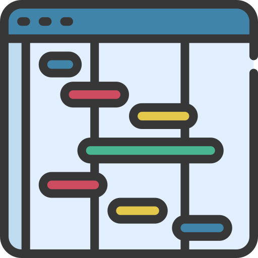

<a href="https://www.flaticon.com/free-icons/gantt" target="_blank">
   </img>
</a>

# Day Off Absence Gantt Chart Service

[](https://www.python.org/downloads/release/python-3137/)
[](https://github.com/psf/black)

[](https://github.com/AleksaMCode/dayoff-absence-gantt-chart-service/actions/workflows/test.yml)

<p align="justify">A microservice that fetches employee absences from <a href="https://tracker.day-off.app">DayOff</a>, builds a Gantt chart image, uploads it to <a href="https://en.wikipedia.org/wiki/SharePoint">SharePoint</a> and posts a Teams channel notification.</p>

<p align="center">

<p align="center">
    <label><b>Fig. 1</b>: Architecture overview</label>
    </p>
</p>

<p align="center">

<p align="center">
    <label><b>Fig. 2</b>: Gantt chart example</label>
    </p>
</p>

## Details

- Fetches accepted absences from DayOff for a configurable window.
- Supports filtering by:
  - team name,
  - team id,
  - or a list of email usernames (the part before `@`).
- Aggregates absences per employee and returns date-level ranges.
- Generates Gantt chart image in memory.
- Uploads image to SharePoint.
- Sends a Teams notification:
  - no absences would result in a text message,
  - absences found would result in an [Adaptive Card](https://learn.microsoft.com/en-us/power-automate/overview-adaptive-cards) with image preview link.

<p align="center">

<p align="center">
    <label><b>Fig. 3</b>: Example Teams message</label>
    </p>
</p>

## API

> [!NOTE]
>
> In practice, the `email_usernames` approach is recommended when reliability is the priority. In limited testing, team-based queries were occasionally behind the latest DayOff team updates. Username filtering is more expensive (it performs one leave-request call per matched user), but it tends to produce more consistent results.

Example request:

```json
{
  "team_name": "Team 1",
  "days_ahead": 5
}
```

Example response:

```json
{
  "team_name": "Team 1",
  "team_id": 12954,
  "window_start": "2026-04-23",
  "window_end": "2026-04-27",
  "employees_count": 1,
  "employees_absences": [
    {
      "employee_id": 284301,
      "name": "User-1",
      "absence_dates": ["2026-04-23", "2026-04-24"]
    }
  ],
  "chart_file_name": "absence-gantt-team-1-2026-04-23-2026-04-27-20260423123456.png",
  "sharepoint_file_url": "https://...sharepoint.../absence-gantt-team-1-....png"
}
```

## SharePoint Authentication Notes

This project supports two SharePoint auth modes, selected by your `.env` values:

1. **Client secret auth**  
   Uses `SHAREPOINT_CLIENT_ID` and `SHAREPOINT_CLIENT_SECRET`.

2. **Certificate auth**  
   Uses `SHAREPOINT_TENANT_ID`, `SHAREPOINT_CERT_FINGERPRINT`, and `SHAREPOINT_PRIVATE_KEY`.

You can quickly generate a self-signed certificate and print its SHA1 thumbprint using:

```bash
bash scripts/create_certificate.sh
```

> [!IMPORTANT] 
> 
> - If you are using SharePoint Online and encounter a `401 Unauthorized`, your environment may require **certificate-based authentication** even when client secrets are configured. 
> - `SHAREPOINT_DIRECTORY` must be a valid server-relative folder path (for example under `Shared Documents`), not just a display folder name.

## Deployment and Scheduling

This service is ideal for scheduled automation after deployment.

Common usage pattern:

- Deploy the API internally.
- Trigger `POST /get_absences` from a scheduler every Monday morning.
- Teams receives weekly absence visibility before standups, planning, or sprint kickoff.

Example Linux cron entry (runs every Monday at 09:00):

```cron
0 9 * * 1 curl -X POST "http://127.0.0.1:8000/get_absences" \
  -H "Content-Type: application/json" \
  -d '{"team_name":"Team 1","days_ahead":5}'
```

> [!NOTE]
> 
> For upcoming sprint planning, use a bigger window.
